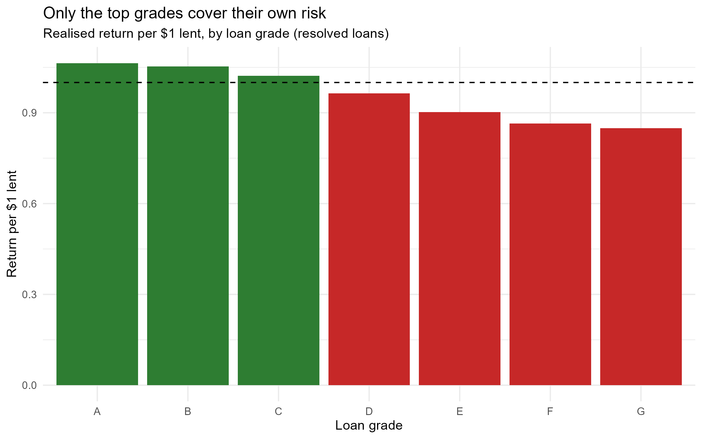

# Does Lending Club's Interest Rate Compensate for Default Risk?

**One-line summary:** An analysis of 44,006 resolved Lending Club loans showing that realised returns turn negative below grade C — and that repricing is unlikely to fix it.

## Business Question

Lending Club assigns each loan a grade from A (safest) to G (riskiest) and charges higher interest on lower grades to compensate for higher default risk. Does that risk premium actually cover the losses? And if not, where does the compensation break down?

## Data

- Source: [Lending Club accepted loans, 2007–2018 (Kaggle)](https://www.kaggle.com/datasets/wordsforthewise/lending-club)
- Sample: first 50,000 rows, filtered to 44,006 loans with a resolved outcome
- Tools: R (tidyverse, ggplot2)

## Approach

1. **Filtered to resolved loans only.** Loans marked "Current", "Late" or "In Grace Period" are still running — their outcome is unknown. Including them as non-defaults would make every grade look artificially safe.
2. **Measured what each grade earns and loses.** Average interest rate charged against the share of loans that were charged off.
3. **Corrected for a flawed comparison.** Interest rate is annual; default rate is lifetime. And a defaulted loan doesn't lose 100% of principal — borrowers usually repay something first. So I computed **realised return per $1 lent** (total repaid ÷ total advanced), which folds interest, defaults, partial recovery and loan term into one comparable figure.

## Key Findings

| Grade | Avg rate | Default rate | Return per $1 |
|-------|----------|--------------|---------------|
| A | 6.8% | 5.3% | **1.06** |
| B | 9.9% | 13.8% | **1.05** |
| C | 13.1% | 23.5% | **1.02** |
| D | 16.7% | 35.2% | **0.964** |
| E | 19.2% | 45.0% | **0.903** |
| F | 23.5% | 52.8% | **0.864** |
| G | 27.6% | 56.5% | **0.849** |

- **Break-even sits between grades C and D.** Every loan graded D or below returned less capital than was advanced.
- **The pricing model recognises risk but under-prices it.** Grade G is charged ~4× grade A's interest rate, yet defaults ~10.7× as often. Risk scales far faster than price.
- **The crude comparison overstates the problem.** Comparing annual rates to lifetime default rates suggested grades B–G were all loss-making. Accounting for term and partial recovery shows B and C are in fact profitable — which materially changes the recommendation.

## Recommendation

**Grades A–C: continue.** Profitable, though C (1.02) is thin enough that a modest downturn would flip it negative. Worth monitoring.

**Grade D: fix, don't cut.** At 0.964 it is only marginally underwater. The lever is *underwriting*, not price — tighten the criteria that place borrowers into D so that stronger applicants migrate to C and the rest are declined.

**Grades E–G: withdraw or restructure.** Losses of 10–15% per dollar lent are not a pricing gap, they're a product problem. Critically, **raising rates further is unlikely to help.** Higher pricing disproportionately deters the better borrowers within a risk band, leaving a worse residual pool — the default rate rises to meet the new rate (adverse selection). The remedy is selection, not price. If the segment is to be served at all, it needs a different instrument — secured lending, co-signers, or smaller principal — rather than a higher coupon.

## Limitations

- **Not a random sample.** The first 50,000 rows of the file, which skew toward a narrow issue-date window rather than the full 2007–2018 period.
- **No discounting.** Return per $1 ignores the time value of money; a dollar repaid over five years is worth less than one repaid over three.
- **Small samples at the tail.** Grade F (n=830) and grade G (n=191) default rates are noisy. The recommendation to withdraw from G rests on 191 loans.
- **Survivorship in resolved-only filtering.** Restricting to completed loans biases slightly toward older vintages, which have had time to resolve.

## Repo Structure

| File | Contents |
|------|----------|
| `analysis.R` | Cleaning and analysis, commented |
| `return_by_grade.png` | Headline chart |
| `README.md` | This file |
